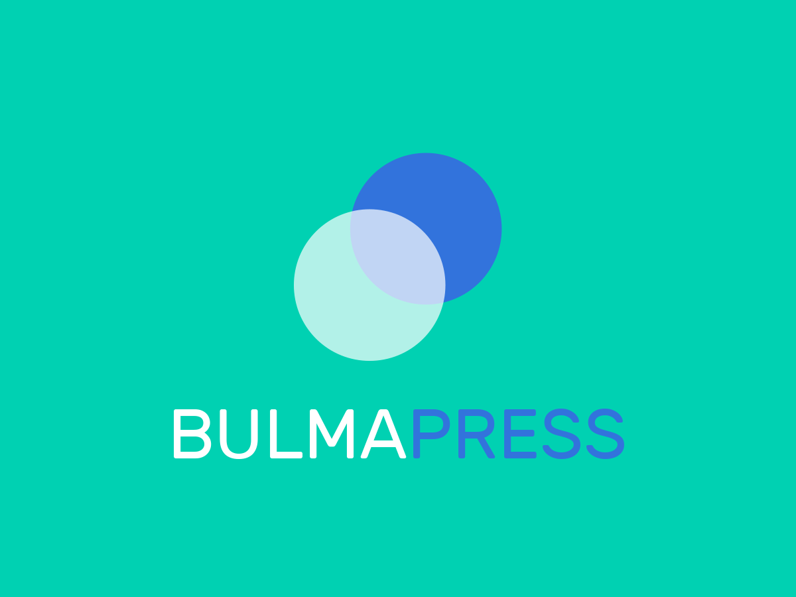

# Bulmapress
## A WordPress flexbox theme

Hi. I'm a WordPress flexbox theme called Bulmapress.

- Based on [Underscores](http://underscores.me/)
- [Bulma](http://bulma.io) integration
- Requires at least: [WordPress](http://wordpress.org) 4.0
- Tested up to: [WordPress 5.0.3](https://wordpress.org/download/)
- Stable tag: 0.0.3
- License: [GNU General Public License v2 or later](http://www.gnu.org/licenses/gpl-2.0.html)

## Demo

[bulmapress.scops.com](https://bulmapress.scops.com/)

## Installation

1. In your admin panel, go to Appearance > Themes and click the Add New button.
2. Click Upload and Choose File, then select the theme's .zip file. Click Install Now.
3. Click Activate to use your new theme right away.

## Frequently Asked Questions

*Does this theme support any plugins?*

Bulmapress includes support for Infinite Scroll in Jetpack.

## Changelog

- *v0.0.4 - Mar 02 2019*: 
  - **Updated Bulma to 0.7.4**
  - **Switched to [Bulma-Navwalker](https://github.com/Poruno/Bulma-Navwalker)**
  - **Add Child-theme support**
- *v0.0.3 - Jan 19 2019*: **Updated Bulma to 0.7.2**
- *v0.0.2 - Dec 30 2017*: **Updated Bulma to 0.6.1**
- *v0.0.1 - Jan 04 2017* : **Initial draft**

## Credits

* Based on Underscores http://underscores.me/, (C) 2012-2016 Automattic, Inc., [GPLv2 or later](https://www.gnu.org/licenses/gpl-2.0.html)
* bulma.io http://bulma.io/, (C) 2017 Jeremy Thomas, [MIT](http://opensource.org/licenses/MIT)
* https://github.com/Poruno/Bulma-Navwalker, (C) 2018 Carlo Operio - @Poruno, [MIT](http://opensource.org/licenses/MIT)
